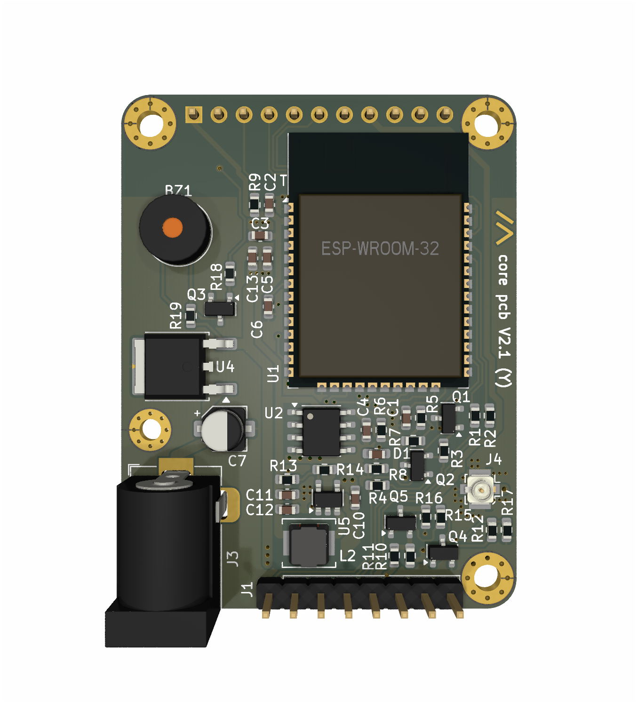
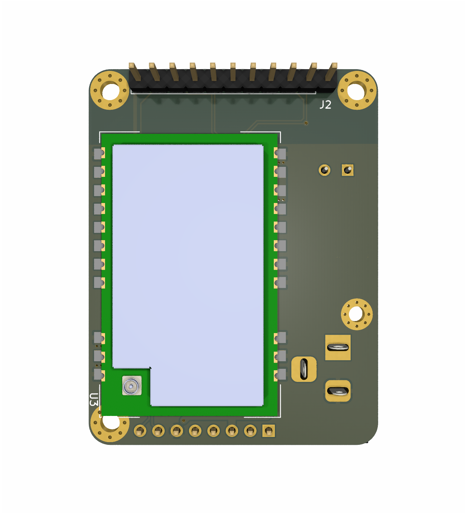

Українська версія 🇺🇦 README доступна в [README_UK-UA.md](README_UK-UA.md).

HydraX is a fork of the [Project Hydra (Meshtastic PCB)](https://github.com/Hydra-Designs/project-hydra-meshtastic-pcb).  It is built on Project Hydra’s foundation with new features and modifications.

# HydraX Meshtastic PCB

## Why?

Because I thought I could. I don’t think the efforts were worth it. :) [Original Project Hydra v2.1](https://github.com/Hydra-Designs/project-hydra-meshtastic-pcb) is already a great solution.

But I had a lot of fun with KiCad, and assembling, as well as debugging my mistakes (see [Warnings](#Warnings) section below.).

## Features
- Supports up to 30dbm (1 watt) transmit power *(Please check local ISM band regulations for power limitations)*
- OLED support via I2C
- GPS support via UART
- PSRAM support (Store & Forward Server mode)
- User button via pin header
- Switchable power rail (GPS power saving)
- ADC input for battery voltage sensing
- Single 5V input (no reverse polarity and overvoltage protection!)
- 3.3V output (or input if onboard buck converter is not assembled)
- Programmable via USB-Serial adapter (RTS/DTR are required for the on-board auto reset!)
- Buzzer for audio notifications
- 7-38V to 5V linear regulator (optional)

## Changes from original Project Hydra

- ESP32-WROOM-32U changed to ESP32-WROOM-32**D** with built-in antenna.
- 5V linear regulator added (optional, 7-35V input) with 5.1mm power jack.
- Buzzer connection with transistor driver added.
- PCB size increased a bit to accommodate new components an ESP antenna (40x52 mm).
- Wider PCB mounting holes, plate's corners rounded.
- Some small trace and footprint changes to comply DRC rules.

## Flaws

- Mounting hole H1 is too close to LoRa module, it does not overlap the hole, but it is very close.
- Mounting hole H1 is in non-standard position, not in the corner, and a bit smaller then others.
- USB to UART converter is not included, you need to use an external one.

## What was tested and works

I ordered bare PCB and assembled one myself.

- ESP32-WROOM-32D works, tested with Meshtastic firmware v. 2.7.7.
- Meshtastic works with eByte E22-400M30S (1W) LoRa module.
- 5V linear regulator works, tested with 12V input.
- Buzzer works.
- GPS power control works.

## What was not tested, does not work

- Auto reset options have worked never for me (put to the bootloader manually with no issues though).
- Haven't tested GPS module.
- Haven't tested OLED display.
- JLCPCB assembly service was not used, did not check the LCSC parts numbers.

## Schematics

Clickable:

## Assembly

### Warnings

Use either **R10** *or* **R11** resistor, not both.  R10 is for a 3.3V power output for GPS or other peripherals, R11 is for a 5V.

*Do not* solder **R15** if you control GPS power via software.

Do not solder **U4**, **C7**, **J3** (the 5V regulator) if you are using an external 5V power source.

Auto reset option is not nessecary if you willing to manually reset the device when uploading new firmware via J1 pins 7 (EN) and 8 (GPIO0).  If you do want auto reset, solder Q1, Q2, R3, R4.

### Bill of Materials

Interactive [iBom](KiCad/HydraX-Meshtastic-PCB/bom/ibom.html) is available.

### Soldering

- If needed, solder the 5V linear regulator.
- Solder other SMD components (except ESP32 and LoRa module).
- Check 5V output (if used) and 3.3V power rail to make sure polarity is correct and you have proper 3.3V.
- Solder ESP32 module, you can see ESP Wi-Fi, or upload simple scetch to test it.
- Add LoRa module (always keep the antenna connected).

### Options

- Use 5V linear regulator (U4, C7) only if you need to power the device from 7-35V.
- 5v/3.3V power output is optional, you can to power external devices (i.e. GPS module). Select power by using either R10 or R11, not both.
- Buzzer parts (R18, R19, Q3) are also optional. Use GPIO26 in the Meshtatic setting to enable it.
- R15 is optional, do not use it if you control GPS power via software (5v/3.3V power output).
- You can omit auto reset parts (Q1, Q2, R3, R4) as you can set ESP32 boot mode by EN and GPIO0 pins of J1 connector.

## Ordering from JLCPCB

Use Gerber files provided on the release page. JLCPCB assembly service was not tested, so please check the LCSC part numbers if needed.

## Programming

### Meshtastic target

The PCB is compatible with Meshtastic DIY v1 target and Meshtastic Hydra. Please check [Meshtastic documentation](https://meshtastic.org/docs/) for details.

### LoRa power

For most LoRa regions, you can't set the power above 20dBm in the firmware, so 1W power is not usable. To use full power you need to modify the firmware and set LoRa power to 22dBm (eByte will set LoRa module to max module power automatically).

### Flashing

You need an external USB to UART converter. Use J1 pins 4 and 5 for RX and TX, pins 3 and 5 for 5V power and GND.

If you soldered auto reset parts, connect RTS and DTR signals of your USB to UART converter to J1 pins 1 and 2 respectively.

If auto reset option does not work, you can put ESP32 to bootloader mode manually by keeping the J1 pin 8 (GPIO0) on the GND and putting shortly pin 7 (EN) to GND.

## Contributing

Please contribute using [Github Flow](https://guides.github.com/introduction/flow/). Create a branch, add commits, and [open a pull request.

## Support

We discuss PCB only here, not Meshtastic itself. I can not guarantee any support, but I will try to help if I can.

Please open an issue for support/ideas.

## License
[GPL v3](https://choosealicense.com/licenses/gpl-3.0/)

[Meshtastic](https://meshtastic.org/)® is a registered trademark of Meshtastic LLC. Meshtastic software components are released under various licenses, see github for details. No warranty is provided - use at your own risk.

This HydraX PCB based on [Project Hydra (Meshtastic PCB)](https://github.com/Hydra-Designs/project-hydra-meshtastic-pcb).