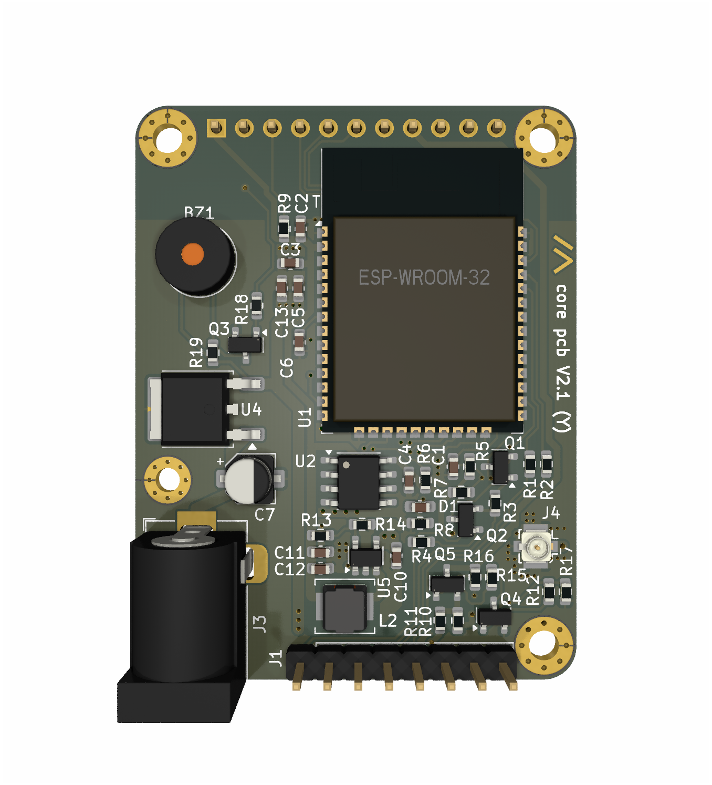
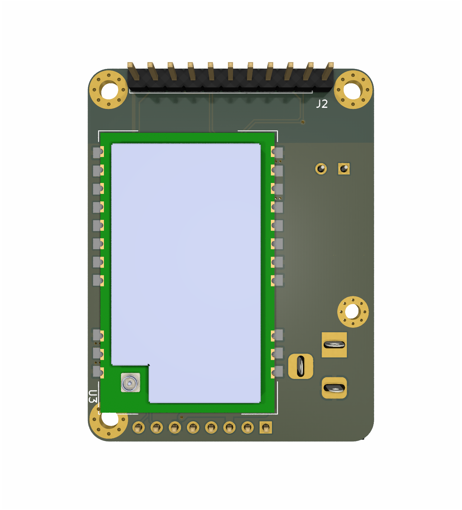
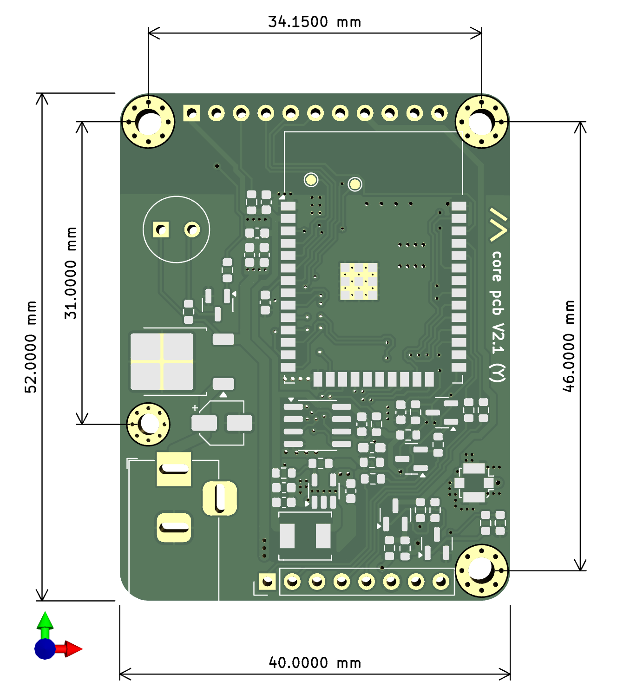
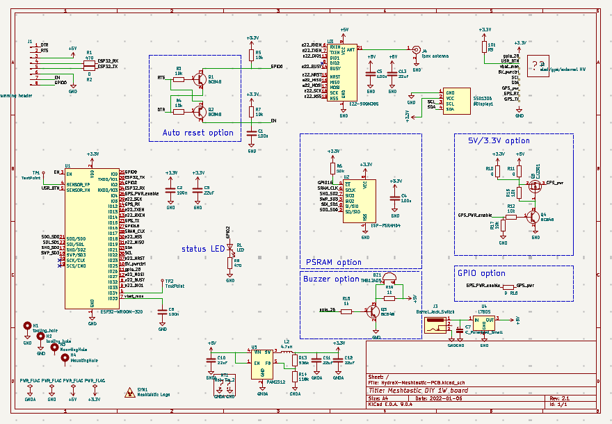

HydraX — це форк [Project Hydra (Meshtastic PCB)](https://github.com/Hydra-Designs/project-hydra-meshtastic-pcb).
Він є модифікацією Project Hydra та містить деякі нові функції.

# HydraX Meshtastic PCB

## Навіщо?

Тому що я думав що зможу. Хоча, мабуть, зусилля не вартували результату. :)
[Оригінальний Project Hydra v2.1](https://github.com/Hydra-Designs/project-hydra-meshtastic-pcb) вже є чудовим рішенням.

Але, я отримав багато задоволення від роботи з KiCad, складання платита пошуку власних помилок (див. розділ [Попередження](#попередження) нижче).

## Можливості
- Підтримка LoRa передавачів потужністю до 30-33 dBm (1-2 Вт)
- Підтримка OLED через I2C
- Підтримка GPS через UART
- Підтримка PSRAM (режим Store & Forward Server)
- Кнопка користувача
- Керований канал живлення (економія енергії для GPS)
- Вимірювання напруги акумулятора через ADC
- Вхід живлення 5В, або 7–38В(опціонально), без захисту від зворотної полярності та перенапруги
- Вбудований регулятор 3,3В
- Програмування через USB-UART адаптер
- Звуковий сигналізатор (пищалка) для аудіо-сповіщень

## Відмінності від оригінального Project Hydra

- ESP32-WROOM-32U замінено на ESP32-WROOM-32**D** із вбудованою антеною.
- Додано 5V лінійний стабілізатор (опціонально, 7–35В на вхід) із роз’ємом живлення 5.1 мм.
- Додано драйвер транзистора для підключення пищалки.
- Збільшено розмір плати для нових компонентів і антени ESP (загальні розміри 40×52 мм).
- Розширені монтажні отвори, закруглені кути плати.
- Невеликі зміни доріжок і посадкових місць для відповідності правилам DRC.

## Недоліки

- Монтажний отвір H1 занадто близько до LoRa-модуля (не перекриває, але майже торкається його). Не критично.
- Отвір H1 у нестандартному місці, не в кутку, і трохи менший за інші.
- USB–UART перетворювач не інтегровано — потрібен зовнішній.

## Протестовано і працює

Я замовив "голу" плату та зібрав одну самостійно.

- ESP32-WROOM-32D працює, перевірено з українською прошивкою Meshtastic v2.7.7.
- Meshtastic працює з LoRa-модулем eByte E22-400M30S (1 Вт).
- Лінійний стабілізатор 5В працює (перевірено з 12В входом).
- Пищалка працює.
- Керування живленням GPS працює.

## Не протестовано / не працює

- Автоскидання для програмування не запрацювало (але ручне завантаження працює без проблем, описано нижче).
- GPS-модуль не перевірявся.
- OLED-дисплей не перевірявся.
- Сервіс складання JLCPCB не використовувався, номери компонентів LCSC не перевірені.

## Схема

Натисніть для завантаження:

Проєкт було створено в [KiCad](https://www.kicad.org/) 9.0.4.

## Збірка

### Попередження

Використовуйте **R10** *або* **R11**, але не обидва (живлення на GPS чи інші периферійні пристрої)).
- R10 — для виходу 3.3В .
- R11 — для виходу 5В.

*Не паяйте* **R15**, якщо керуєте живленням GPS програмно.

Не паяйте **U4**, **C7**, **J3** (5В стабілізатор), якщо живите пристрій від зовнішніх стабільних 5В.

Автоскидання для прошивки не обов’язкове: можна вручну скидати пристрій при завантаженні прошивки через піни J1 7 (EN) і 8 (GPIO0).

Якщо ж потрібне автоскидання — впаюйте Q1, Q2, R3, R4.

### Перелік матеріалів (Bill of Materials)

Є інтерактивний [iBom](KiCad/HydraX-Meshtastic-PCB/bom/ibom.html).

### Паяння

- За потреби, припаяйте 5В лінійний стабілізатор.
- Припаяйте інші SMD-компоненти (крім ESP32 і LoRa-модуля).
- Перевірте вихід 5В (якщо використовується) і лінію 3.3В на правильність полярності і що напруга правильна.
- Припаяйте ESP32, перевірте роботу Wi-Fi або завантажте тестовий скетч.
- Додайте LoRa-модуль (**антена завжди має бути підключена**).

### Опції

- Використовуйте стабілізатор 5В (U4, C7) лише якщо живите від 7–35В.
- Вихід 5В/3.3В — опціональний (живлення зовнішніх пристроїв, наприклад GPS). Оберіть напругу через R10 або R11.
- Компоненти пищалки (R18, R19, Q3) — опціональні. Для активації використовуйте GPIO26 у Meshtastic.
- R15 не використовуйте, якщо GPS вмикається програмно.
- Можна не робити автоскидання (Q1, Q2, R3, R4) та виставляти режим завантаження ESP32 вручну через EN та GPIO0 на роз’ємі J1.

## Замовлення у JLCPCB
"
Використовуйте Gerber-файли з розділу "релізи".
Сервіс паяння на JLCPCB не перевірявся, тож номери деталей LCSC треба звіряти вручну.

## Програмування

### Ціль для Meshtastic

Плата сумісна з Meshtastic DIY v1 target та Meshtastic Hydra.
Для докладної інформації дивіться [документацію Meshtastic](https://meshtastic.org/docs/).

### Потужність LoRa

У більшості регіонів LoRa максимальна потужність у прошивці обмежена 20 dBm, тому 1 Вт не буде використаний.
Щоб активувати повну потужність, потрібно змінити прошивку та встановити 22 dBm — тоді LoRa модуль eByte автоматично працюватиме на максимумі.

### Прошивання

Потрібен зовнішній USB–UART перетворювач. Контакти роʼєму такі:
- J1 пін 4 → RX
- J1 пін 5 → TX
- J1 пін 3 → 5V
- J1 пін 5 → GND

Якщо автоскидання реалізовано — підключіть RTS і DTR вашого конвертера до:
- J1 пін 1 (RTS)
- J1 пін 2 (DTR)

Якщо автоскидання не працює, перемикайте ESP32 в режим завантаження прошивки вручну:
- тримайте J1 пін 8 (GPIO0) на GND (мінус),
- коротко замкніть пін 7 (EN) на GND.

## Участь у проєкті

Використовуйте [Github Flow](https://guides.github.com/introduction/flow/): створюйте гілку, робіть коміти та створюйте pull request.

## Підтримка

Обговорюємо тут лише **PCB**, не сам Meshtastic.
Я не можу гарантувати підтримку, але спробую допомогти, якщо зможу.

Відкривайте issue для питань чи ідей.

## Ліцензія

[GPL v3](https://choosealicense.com/licenses/gpl-3.0/)

[Meshtastic](https://meshtastic.org/)® — зареєстрована торгова марка Meshtastic LLC. Програмні компоненти Meshtastic поширюються під різними ліцензіями, див. GitHub. Жодних гарантій не надається — використовуйте на власний ризик.

Ця плата HydraX базується на [Project Hydra (Meshtastic PCB)](https://github.com/Hydra-Designs/project-hydra-meshtastic-pcb).
